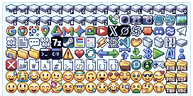

# EdgThumb

[日本語](#日本語) | [English](#english)



---

## English

A Windows Explorer shell extension that shows thumbnails of EDGE2 (`.edg`) files.

**This is an unofficial tool. It is not affiliated with Takabo Soft.**
Many thanks to Takabo Soft, the author of [EDGE2](https://takabosoft.com/edge2), for the editor and for publishing the [EDGE2 File Loader Library](https://takabosoft.com/download/win/edge2/edge2_loader_100.zip), which this project used as the reference for the file format.

### What it does

- Shows the page that is currently open in EDGE2, composed the way EDGE2 shows it: layer visibility modes and layer groups are applied. The background colour is transparent.
- Supports EDGE2 files of 1 / 4 / 8 / 15 / 16 / 24 bit. EDGE1 files (which also use `.edg`) are not supported.
- Windows 10 / 11 **x64 only**. ARM64 Windows is not supported.
- `EdgThumb.dll` is **not code-signed**. Windows may show a warning.

### Scaling

Pixel art is enlarged or reduced by whole-number steps only, and never interpolated. Smoothing blurs the dots, and averaging makes one-pixel lines disappear. The thumbnail is always exactly the size Explorer asks for, with the picture centred on a transparent canvas, so that Explorer has nothing left to resample. Because of this, a very large picture reduced by 1/5 or more may lose one-pixel-wide lines. That is the price of not interpolating.

### Install / uninstall

Run `EdgThumbSetup-1.0.0.exe` (administrator rights are required; the handler is registered under `HKLM`). At the end, the installer asks whether to restart Explorer. Thumbnails appear after Explorer restarts.

To uninstall, use Windows Settings > Apps > Installed apps.

### Thumbnails are old or missing

Explorer caches thumbnails and keeps showing the old result. Restart Explorer, or run `refresh-thumbnails.bat`, which clears Explorer's thumbnail cache **for all file types** (Explorer regenerates it, but the first browse of a large folder is slower). To rule out the cache, copy the file under another name and look at the copy.

`build\edgdump.exe <in.edg> <out.png>` writes the same decoded image as a PNG. It is useful for telling a decoder problem from an Explorer problem.

### File format

Notes from the EDGE2 File Loader Library (MIT). See it for the full details. No code from it is included here.

```
[0..4]   "EDGE2"
[5..6]   local version (u16, must be 0)
[7]      compression (u8, 1 = zlib)
[8..11]  size after expansion (u32 LE)
[12..]   zlib stream
```

The expanded body is a sequence of chunks, nested: `id u16 | length u32 | data`. An id is unique only within its own level.

| Level | ID | Meaning |
|---|---|---|
| root | 1000 | bit depth (1/4/8/15/16/24) |
| root | 2002 / 2003 / 2004 | fixed palette per page / page (many) / current page index |
| root | 3001 / 3003 / 3004 | palette colour count / palette (many) / current palette index |
| root | 3006, 3008 | background colour (old form: index; new form: 1000 = index, 1001 = BGR) |
| page | 1005 / 1006 | width / height (u16) |
| page | 1007 / 1008 | linked palette id / index cache |
| page | 2000 | layer visibility mode (0-6) |
| page | 2003 / 2004 | layer (many, **first = topmost**) / current layer index |
| layer | 1002 / 1005 / 1006 | grouped / visible / image (`width x height x bytes per dot`) |
| palette | 1001 / 1005 | id / colours (`count x 3` bytes, **BGR**) |

Layers are drawn from the bottom up; dots equal to the background colour are not drawn and stay transparent.

### Build

See [DEVELOPMENT.md](DEVELOPMENT.md). `samples/icons.edg` is a small test file: `build\edgdump.exe samples\icons.edg out.png`.

### Disclaimer

Use EdgThumb at your own risk. It runs as part of Windows Explorer and changes the registry when installed. The author accepts no responsibility for any damage or loss caused by using it. Back up important files before installing.

### License

MIT. See [LICENSE](LICENSE) and [THIRD_PARTY_LICENSES.txt](THIRD_PARTY_LICENSES.txt).

The artwork in `samples/icons.edg` and `docs/thumbnails.png` is by Micromochi_Teno and is **not** covered by the MIT License. You may use it only to test and demonstrate EdgThumb. Logos and product names drawn in it are trademarks of their respective owners.

---

## 日本語

エクスプローラーで EDGE2 の `.edg` ファイルをサムネイル表示するシェル拡張です。

**非公式ツールです。EDGE2 の作者 Takabo Soft とは無関係です。**
[EDGE2](https://takabosoft.com/edge2) と、ファイル形式の参考にさせていただいた [EDGE2 ファイルローダーライブラリ](https://takabosoft.com/download/win/edge2/edge2_loader_100.zip)を公開してくださっている Takabo Soft さんに感謝します。

### 表示されるもの

- EDGE2 で今開いているページ。レイヤーの可視モードとグループを反映した、EDGE2 上と同じ見え方の合成結果です。背景色は透明になります。
- 対応するのは EDGE2 形式の 1 / 4 / 8 / 15 / 16 / 24bit です。同じ拡張子の EDGE1 形式は非対応です。
- Windows 10 / 11 の **x64 のみ**対応です。ARM64 版 Windows は非対応です。
- `EdgThumb.dll` には**コード署名がありません**。Windows が警告を出すことがあります。

### 拡大縮小

ドット絵なので、整数倍・整数分の1でのみ拡大縮小し、補間はかけません。補間するとドットがぼやけ、平均化すると1ピクセル幅の線が消えるためです。サムネイルは、エクスプローラーが要求したサイズちょうどの正方形にして、絵を透明な余白の中央に置いて返します。こうするとエクスプローラー側でそれ以上リサイズされません。その代わり、1/5 以下のように大きく縮める場合は、1ピクセル幅の線が間引かれて消えることがあります。補間しないことの代償です。

### インストール・アンインストール

`EdgThumbSetup-1.0.0.exe` を実行します（`HKLM` に登録するので管理者権限が必要です）。最後にエクスプローラーを再起動するか聞かれます。再起動するとサムネイルが出ます。

アンインストールは、Windows の設定「アプリ > インストールされているアプリ」から行います。

### サムネイルが古い・出ないとき

エクスプローラーはサムネイルをキャッシュしていて、前の結果を返し続けることがあります。エクスプローラーを再起動するか、`refresh-thumbnails.bat`（サムネイルキャッシュを消します。**全ファイル種別が対象**で、消しても自動で作り直されますが、大きなフォルダを最初に開くときは遅くなります）を実行してください。キャッシュの影響を除くには、ファイルを別名でコピーして、そのコピーを見ます。

`build\edgdump.exe <in.edg> <out.png>` は、同じデコーダで PNG を出力する確認用ツールです。表示がおかしいとき、デコーダの問題かエクスプローラーの問題かの切り分けに使えます。

### .edg ファイル形式

EDGE2 ファイルローダーライブラリ（MIT）を参考にした要点です。詳細はそちらを参照してください。コードは含んでいません。

```
[0..4]   "EDGE2"
[5..6]   ローカルバージョン（u16、0 のみ対応）
[7]      圧縮方式（u8、1 = zlib）
[8..11]  展開後のサイズ（u32 LE）
[12..]   zlib ストリーム
```

展開後の本体は、入れ子になったチャンクの列です：`id u16 | length u32 | data`。ID は同じ階層の中でだけ一意です。

| 階層 | ID | 意味 |
|---|---|---|
| ルート | 1000 | ビット数（1/4/8/15/16/24） |
| ルート | 2002 / 2003 / 2004 | ページ固定パレット / ページ（複数）/ カレントページ |
| ルート | 3001 / 3003 / 3004 | パレット色数 / パレット（複数）/ カレントパレット |
| ルート | 3006, 3008 | 背景色（旧形式：index。新形式：1000 = index、1001 = BGR） |
| ページ | 1005 / 1006 | 幅 / 高さ（u16） |
| ページ | 1007 / 1008 | 固定パレットのリンク ID / index キャッシュ |
| ページ | 2000 | レイヤー可視モード（0〜6） |
| ページ | 2003 / 2004 | レイヤー（複数、**先頭が最上層**）/ カレントレイヤー |
| レイヤー | 1002 / 1005 / 1006 | グループ化 / 可視 / 画像（`幅 x 高さ x 1ドットのバイト数`） |
| パレット | 1001 / 1005 | ID / 色（`色数 x 3` バイト、**BGR 順**） |

レイヤーは下から順に描き、背景色と同じドットは描かずに透明のままにします。

### ビルド

[DEVELOPMENT.md](DEVELOPMENT.md) を参照してください。`samples/icons.edg` はテスト用の小さなファイルです（`build\edgdump.exe samples\icons.edg out.png`）。

### 免責事項

EdgThumb は自己責任でお使いください。エクスプローラーの一部として動作し、インストール時にレジストリを変更します。使用によって生じたいかなる損害・損失についても、作者は責任を負いません。大切なファイルは、インストール前にバックアップを取っておいてください。

### ライセンス

MIT。[LICENSE](LICENSE) と [THIRD_PARTY_LICENSES.txt](THIRD_PARTY_LICENSES.txt) を参照してください。

`samples/icons.edg` と `docs/thumbnails.png` の絵は Micromochi_Teno の作品で、MIT ライセンスの**対象外**です。EdgThumb の動作確認と紹介の目的でのみ使えます。絵に含まれるロゴや製品名は、それぞれの権利者の商標です。
